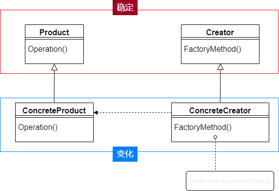

# 工厂方法模式

### 动机
* 在软件系统中，经常面临着创建对象的工作；由于需求的变化，需要创建的对象具体类型经常变化

* 如何应对这种变化？如何绕过常规的对象创建方法（new），提供一种“封装机制”来避免客户程序和这种“具体对象创建工作”的紧耦合？

### 模式定义
* 定义一个用于创建对象的接口，让子类决定实例化哪个类。Factory Method使得一个类的实例化延迟（目的：解耦，手段：虚函数）到子类

### 结构

### 要点
* Factory Method模式用于隔离类对象的使用者和具体类型之间的耦合关系。面对一个经常变化的具体类型，紧耦合关系（new）会导致软件的脆弱。

* Factory Method模式通过面向对象的手法，将所要创建的具体对象工作延迟到子类，从而实现一种扩展（而非更改）的策略，较好地解决了这种紧耦合关系。

* Factory Method模式解决“单个对象”的需求变化。缺点在于要求创建方法、参数相同。