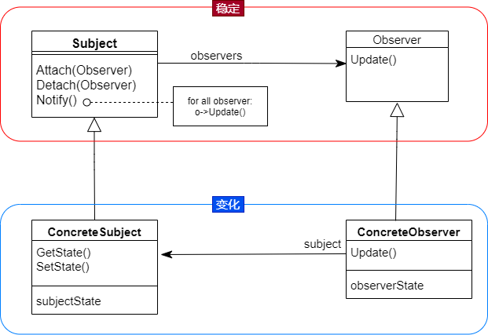

# 观察者模式（同EVENT）

### 动机
* 在软件构建过程中，我们需要为某些对象建立一种“通知依赖关系”， 一个对象（目标对象）的状态发生改变，所有的依赖对象（观察者对象）都将得到通知。如果这样的依赖关系过于紧密，将使软件不能很好地抵御变化

* 使用面向对象技术，可以将这种依赖关系弱化，并形成一种稳定的依赖关系。从而实现软件体系结构的松耦合

### 模式定义
* 定义对象间的一种一对多（变化）的依赖关系，以便当一个对象的状态发生改变时，所有依赖于它的对象都得到通知并自动更新

### 结构

### 要点
* 可以独立改变目标和观察者，从而使两者之间的依赖关系达致松耦合
* Observer模式是基于事件的UI框架中非常常用的设计模式，也是MVC模式的一个重要组成部分

### 个人理解
* 相比于中介者模式，观察者模式更倾向于发布-订阅模式，两者的关系是松散的，如果是中介者模式，主要体现在同事类（Colleague）之间的互相调用，启到媒介的作用
