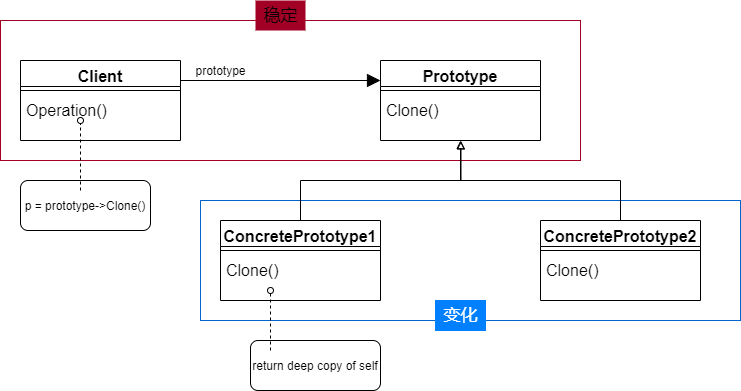

# 原型模式

### 动机
* 在软件系统中，经常面临着“某些结构复杂的对象”的创建工作；由于需求的变化，这些对象经常面临着剧烈的变化，但是它们却拥有比较稳定一致的接口

* 如何应对这种变化？如何向“客户程序（使用这些对象的程序）”隔离出“这些易变对象”，从而使得“依赖这些易变对象的客户程序”不随着需求改变而改变？

### 模式定义
* 使用原型实例指定创建对象的种类，然后通过拷贝（深克隆）这些原型来创建新的对象

### 结构

### 要点
* Prototype模式同样用于隔离类对象的使用者和具体类型（易变类）之间的耦合关系，它同样要求这些“易变类”拥有“稳定的接口”。

* Prototype模式对于“如何创建易变类的实体对象”采用“原型克隆”的方法来做，它使得我们可以非常灵活地动态创建“拥有某些稳定接口”的新对象————所需工作仅仅是注册一个新类的对象（即原型），然后在任何需要的地方Clone。

* Prototype模式中的Clone方法可以利用某些框架中的序列化来实现深拷贝。

* 开发过程中一般用的比较少，算是工厂方法的一个变形，原型模式对比工厂方法，主要体现在对象的“复杂性”，以及对象某种特定状态。