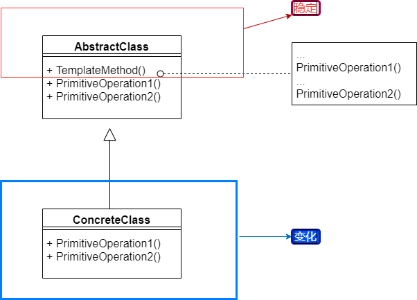

# 模板方法

### 动机
* 在软件构建过程中，对于某一项任务，它常常有（稳定）的整体操作结构，但各个子步骤却有很多（改变）的需求，或者由于固有的原因（比如框架和应用之间的关系）而无法和任务的整体结构同时实现

* 如何在确定（稳定）操作结构的前提下，来灵活应对各个子步骤的变化或者晚期实现需求

### 模式定义
* 定义一个操作中的算法骨架（稳定），而将一些步骤延迟（变化）到子类中。Template Method使得子类可以不改变（复用）一个算法的结构即可重写该算法的某些特定步骤

### 结构

### 要点
* 提供程序框架机制，给子步骤灵活的扩展
* 反向控制结构（不要调用我，我来调用你）